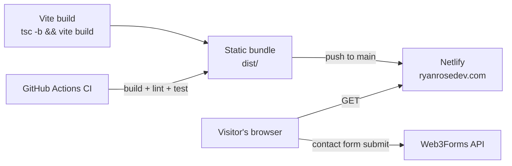

# rr-dev


Personal portfolio site for Ryan Rose, frontend developer.

## Quickstart

```bash
npm install
cp .env.example .env.local   # fill in VITE_WEB3FORMS_KEY
npm run dev                  # http://localhost:5173
```

**Env vars** (`.env.local`, gitignored):

- `VITE_WEB3FORMS_KEY` — public form key for the contact modal
  ([web3forms.com](https://web3forms.com))

**Deploy**: push to `main` — Netlify builds and deploys automatically.

## Stack

- Vite 8 + React 19 + TypeScript
- SCSS Modules only, no Tailwind
- Framer Motion for animations
- Radix UI for accessible primitives (Dialog, VisuallyHidden)
- Jest + React Testing Library + jest-axe for unit/component/a11y tests
- ESLint with eslint-plugin-jsx-a11y for lint-time accessibility checks
- Playwright + axe-core for a real-browser accessibility sweep, plus a
  supplementary Lighthouse accessibility check

## Architecture

This is a static single-page site — no backend, no database, no auth.
The only outbound integration is the contact form.



- **No backend, no auth**: the entire app is static HTML/CSS/JS shipped
  from Netlify. There's nothing to authenticate and no server-side
  surface to secure.
- **Contact form**: `ContactModal.tsx` posts directly to Web3Forms
  using a public, client-embedded form key
  (`VITE_WEB3FORMS_KEY` — see the Quickstart above). Web3Forms
  relays the submission to email; this repo never stores or sees
  submitted messages.
- **Deploy**: push to `main` → Netlify builds and deploys automatically.
  No staging environment; this is a portfolio site, not a product with
  meaningful environment promotion needs.
- **CI**: `.github/workflows/ci.yml` runs build+lint+test on every push
  and PR to `main`, gating merges on the same `npm run precommit` gate
  used locally.

## Conventions

- Components: PascalCase (`HeroSection.tsx`)
- Files: kebab-case (`hero-section.module.scss`)
- Path alias: `@/` maps to `src/`
- No inline styles — ever
- SCSS lives next to its component, not in a global folder
- Global styles, variables, and mixins live in `src/styles/`

## Accessibility

Section 508 / WCAG 2.1 AA is first-class throughout, and it's test-backed,
not just a claim: every component has a jest-axe test, color/background
pairs are checked against a WCAG contrast-ratio calculator
(`src/utils/contrast-ratio.ts`), eslint-plugin-jsx-a11y runs at lint time,
and a real-browser Playwright + axe-core sweep (`npm run test:a11y`)
catches contrast and whole-page issues that jsdom-based tests structurally
can't. Every interactive element needs a keyboard path. Modals trap focus
and return it on close. Animations respect `prefers-reduced-motion`.

This is shown as a set of automated checks, not a compliance score or
badge. A static "100%" claim is a snapshot that can go stale or overstate
what automated tooling actually catches. The checks themselves, run on
every component and verified in a real browser, are the evidence.

## Scripts

- `npm run dev` — start dev server
- `npm run build` — production build
- `npm run format` — Prettier
- `npm test` — Jest
- `npm run test:watch` — Jest watch mode
- `npm run test:coverage` — Jest with a coverage report
- `npm run test:a11y` — real-browser accessibility sweep (Playwright + axe-core)
- `npm run lighthouse:a11y` — Lighthouse accessibility check (dev server must be running)
- `npm run precommit` — build + lint + test in one command

## Structure

src/
components/
layout/ # Nav, Footer
sections/ # Hero, About, Skills, Experience, Testimonials, Contact
ui/ # Button, Modal, Pill, StatCard — reusable primitives
hooks/ # Custom React hooks
styles/ # globals.scss, \_variables.scss, \_mixins.scss
types/ # Shared TypeScript types
utils/ # Pure helper functions
assets/ # Fonts, images
