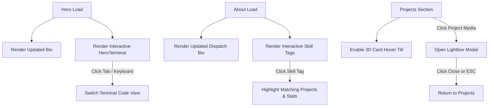

# PRD: Site Enhancements & Bio Text Revamp

## Problem
The portfolio site needs to showcase top-tier Frontend Engineering skills through interactive components (Hero Terminal, 3D project card tilt, demo lightbox, skill filtering matrix) while providing an authentic, story-driven bio that accurately reflects Ryan Rose's career trajectory from U.S. Army service to Biomedical Engineering at UTSA, #VetsWhoCode, and professional FE development with AI workflow optimization.

## Success Criteria
- [ ] Updated bio copy rendered cleanly in Hero and About sections (zero em dashes, contrast compliant).
- [ ] Interactive `HeroTerminal` component in Hero with 3 interactive tab views (`dispatch.ts`, `ai-workflow.ts`, `metrics.json`).
- [ ] Project cards enhanced with 3D spring tilt physics (mouse hover) and click-to-open image demo Lightbox Modal.
- [ ] Interactive Skill Matrix in About section allowing tag clicks to highlight matching projects.
- [ ] 100% test coverage with Jest + React Testing Library + `jest-axe` for all new components.
- [ ] Full accessibility compliance (`npm test` & `npm run test:a11y` green).

## User Stories
- As a **hiring manager / recruiter**, I want to quickly read an authentic bio and interact with live engineering terminal tabs so I can gauge Ryan's technical depth, AI workflow discipline, and frontend craftsmanship.
- As a **peer developer**, I want to interact with project cards, open high-res demo lightboxes, and filter tech skills so I can evaluate the engineering standard of the work.

## Design Direction & UI Specs
- **Palette**: Dark mode primary `$navy` (`#040d1a`), layered `$navy-900`/`$navy-800`, `$electric-blue` (`#38bdf8`), `$teal` (`#64e4c8`).
- **Typography**: Syne (headings), DM Mono (code/mono), DM Sans (body).
- **Interactions**: Framer Motion entrance animations, mouse-position spring physics for tilt, accessible keyboard navigation (`Tab`, `Enter`, `Space`, `Esc`).
- **Accessibility**: All interactive elements have `:focus-visible` focus rings, `aria-label`/`aria-selected` attributes, and pass `jest-axe`.

## User Flow & State Diagram



## UI States Matrix
| Component | Default State | Interactive / Active State | Reduced Motion / Mobile |
|-----------|---------------|----------------------------|-------------------------|
| `HeroTerminal` | Displays `dispatch.ts` tab | Displays active tab with syntax highlighting | Static tab switching without sliding transitions |
| `ProjectCard` | Flat 2D position | Subtle 3D tilt following cursor position | Tilt disabled (flat transform) |
| `ImageLightboxModal` | Hidden (`isOpen=false`) | Portal rendered over backdrop (`isOpen=true`) | Instant fade without scaling transition |
| `SkillTag` | Standard pill badge | Active filter highlight styling | Same functional highlight state |

## Scope Boundaries
### In Scope
- Bio copy updates in `Hero.tsx` and `About.tsx`.
- `HeroTerminal.tsx` + SCSS + unit/a11y tests.
- `ImageLightboxModal.tsx` + SCSS + unit/a11y tests.
- `ProjectCard.tsx` 3D tilt integration.
- About section interactive skill tag click-to-highlight logic.

### Out of Scope
- Backend API services or database integrations (site remains 100% frontend static client).
- Third-party analytics or external telemetry additions.

## Data Contracts
- **Inputs**: `PROJECTS` array, `SKILL_GROUPS` array, `reducedMotion` hook state.
- **Outputs**: Rendered DOM with WCAG AA accessibility attributes, modal open/close state.
- **Persistence**: Purely in-memory React component state.

## Edge Cases
- Viewport < 480px: Terminal switches to stacked compact layout, lightbox fits screen bounds with scrollable overflow if needed.
- `useReducedMotion() === true`: Animation variants fall back to instant visibility, 3D tilt is bypassed.
- Esc key pressed while Lightbox is open: Modal closes immediately and restores focus to triggering image.

---

```
PRD COMPLETE

Saved to: docs/prd/site-enhancements-revamp.md

Ready to run /3-to-issues
```
