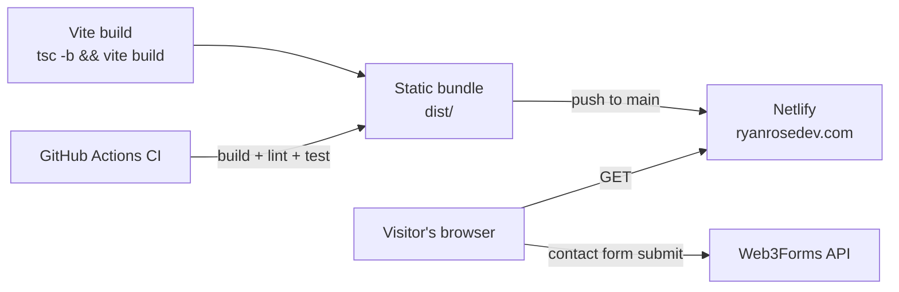

# Architecture

This is a static single-page site — no backend, no database, no auth.
The only outbound integration is the contact form.

## Notes

- **No backend, no auth**: the entire app is static HTML/CSS/JS shipped
  from Netlify. There's nothing to authenticate and no server-side
  surface to secure.
- **Contact form**: `ContactModal.tsx` posts directly to Web3Forms
  using a public, client-embedded form key
  (`VITE_WEB3FORMS_KEY` — see `README.md` Quickstart). Web3Forms
  relays the submission to email; this repo never stores or sees
  submitted messages.
- **Deploy**: push to `main` → Netlify builds and deploys automatically.
  No staging environment; this is a portfolio site, not a product with
  meaningful environment promotion needs.
- **CI**: `.github/workflows/ci.yml` runs build+lint+test on every push
  and PR to `main`, gating merges on the same `npm run precommit` gate
  used locally.
